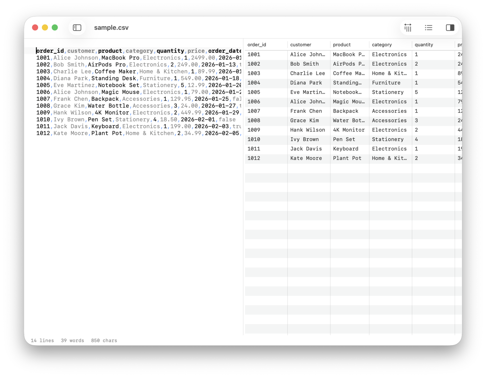

# TinyCSV

A native macOS CSV and TSV viewer. See your data as a sortable table — click any cell to jump to it in the source.




## Features

- **Three-panel layout** — file sidebar, editor, and table preview
- **Syntax highlighting** — commas, quotes, and field structure
- **Live preview** — spreadsheet-style table rendered as you type
- **Directory browsing** — navigate folders, subdirectories, and files
- **Quick open** — fuzzy file finder (Cmd+P)
- **Auto-save** — saves as you type with dirty-file indicators
- **Find & replace** — native macOS find bar (Cmd+F)
- **Tab support** — multiple files in tabs
- **Line numbers** — optional gutter with current line highlight
- **Word wrap** — toggle with Opt+Z
- **Font size control** — Cmd+/Cmd- to adjust, Cmd+0 to reset
- **Light & dark mode** — follows system appearance
- **Status bar** — row count, column count, file size
- **Open from Finder** — double-click `.csv` or `.tsv` files to open in TinyCSV
- **On-device AI** — Cmd+K to ask questions about your data (CoreML, fully offline)

## Requirements

- macOS 26.0+
- Xcode 26+ (to build)

## Build

```bash
xcodebuild clean build \
  -project TinyCSV.xcodeproj \
  -scheme TinyCSV \
  -configuration Release \
  -derivedDataPath /tmp/tinybuild/tinycsv \
  CODE_SIGN_IDENTITY="-"

cp -R /tmp/tinybuild/tinycsv/Build/Products/Release/TinyCSV.app /Applications/
```

## Keyboard Shortcuts

| Shortcut | Action |
|---|---|
| Cmd+N | New file |
| Cmd+O | Open folder |
| Cmd+S | Save |
| Cmd+P | Quick open |
| Cmd+F | Find |
| Cmd+K | AI assistant |
| Opt+Z | Toggle word wrap |
| Opt+P | Toggle preview |
| Opt+L | Toggle line numbers |
| Cmd+= / Cmd+- | Font size |
| Cmd+0 | Reset font size |

## Tech

Built with SwiftUI, NSTextView, and TinyKit.

## Part of [TinySuite](https://tinysuite.app)

Native macOS micro-tools that each do one thing well.

| App | What it does |
|-----|-------------|
| [TinyMark](https://github.com/michellzappa/tinymark) | Markdown editor with live preview |
| [TinyTask](https://github.com/michellzappa/tinytask) | Plain-text task manager |
| [TinyJSON](https://github.com/michellzappa/tinyjson) | JSON viewer with collapsible tree |
| **TinyCSV** | Lightweight CSV/TSV table viewer |
| [TinyPDF](https://github.com/michellzappa/tinypdf) | PDF text extractor with OCR |
| [TinyLog](https://github.com/michellzappa/tinylog) | Log viewer with level filtering |
| [TinySQL](https://github.com/michellzappa/tinysql) | Native PostgreSQL browser |

## License

MIT
